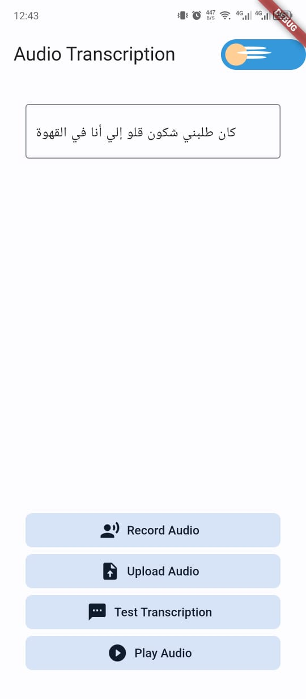
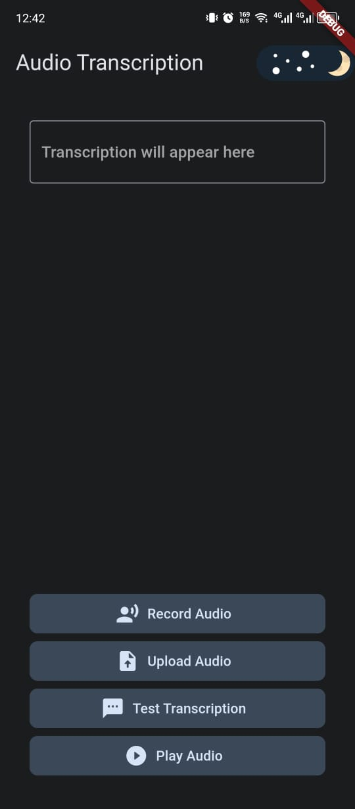

# TunisianASR

TunisianASR is an Automatic Speech Recognition (ASR) mobile app specifically designed to transcribe Tunisian Arabic speech.
The Transcription can be made using a real time recording or an audio file from the device local Storage. 

## Technologies

- **WavLM Model**: Transformer-based deep neural network for speech recognition.
- **KenLM**: 4-gram language model for enhanced transcription accuracy.
- **Gradio**: Interface for creating API and web-based demos.
- **Flutter and Dart**: For developing the mobile app.
- **Hugging Face**: Hosting and deployment platform for the ASR model.

## Screenshots

### Dark Mode

*App in Dark Mode*

### Light Mode

*App in Light Mode*

